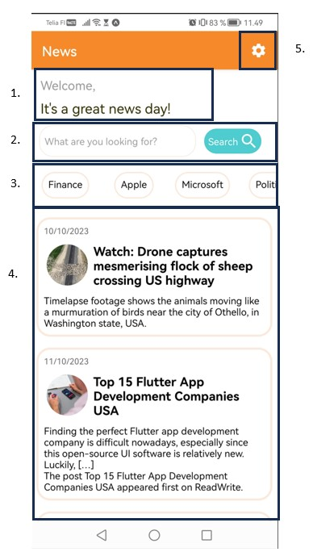
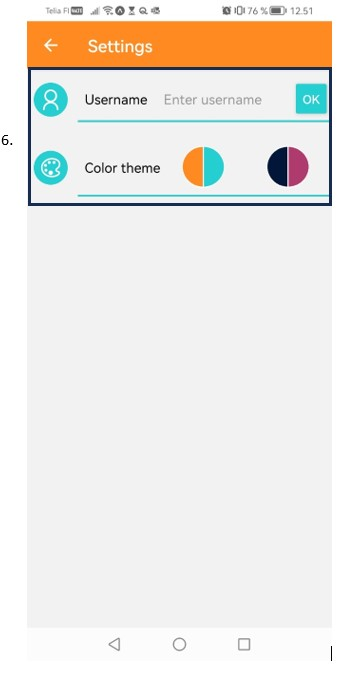
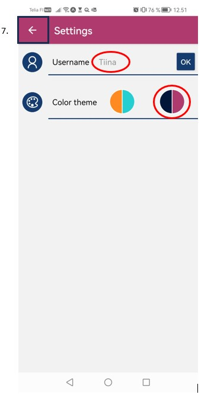
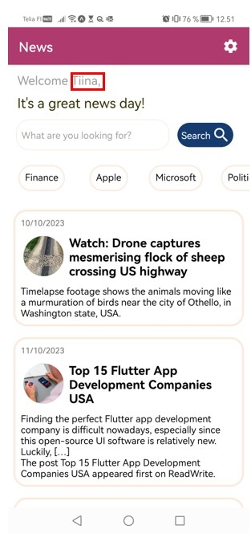

# newsApp
OAMKin web- ja hybriditeknologiat -kurssin palautettava lopputyö

## Yleisesti 
Tehtävässä on toteutettu mobiilisovellus, joka hakee uutisia käyttäjän valitsemasta aiheesta News API-rajapinnan kautta (https://newsapi.org/). Lisäksi käyttäjä voi antaa sovellukselle käyttäjänimensä ja muuttaa väriteemaa. 

Sovelluksen toteutuksessa on harjoiteltu erilaisia mobiilisovelluksen toiminnalisuuksia, kuten tiedon hakemista rajapinnan kautta, tiedon tallentamista puhelimen muistiin ja navigointia sivujen välillä.

## Sovelluksen käyttöönotto
Sovelluksen käyttämiseksi ota repositoryn koodit omalle koneellesi. Aja sen jälkeen komento "npm i", jotta sovelluksen vaatimat kirjastot asentuvat. Rajapinnan käyttämistä varten sovelluksen juureen tulee lisätä tiedosto ".env", johon lisätään vakiot EXPO_PUBLIC_API_URL ja EXPO_PUBLIC_API_KEY. EXPO_PUBLIC_API_URL-vakion tulee sisältää rajapinnan url-osoite ilman keyword ja api key -muuttujia. EXPO_PUBLIC_API_KEY-vakion tulee sisältää rajapinnan api key. Henkilökohtaisen api keyn saa käyttöönsä kirjautumalla rajapintapalvelun käyttäjäksi osoitteessa https://newsapi.org/. Vaihtoehtoisesti url-osoitteen ja api keyn voi lisätä suoraan News.js-tiedoston api-objektiin. 

## Sovelluksen toiminnallisuudet
Kun sovellus avataan ensimmäisen kerran, näytöllä näkyy News-sivu. 
1. Sivun yläosassa on palkki, joka näyttää sivun otsikon sekä mutteri-ikonin, josta käyttäjä voi siirtyä asetukset-sivulle. 
2. News-sivun yläosassa näkyy lisäksi tervehdysteksti ja hakukenttä, johon käyttäjä voi kirjoittaa valitsemansa aiheen ja hakea aihetta koskevia uutisia painamalla Search-nappia.
3. Vaihtoehtoisesti käyttäjä voi myös hakea uutisia valmiista kategoiroista, joita on listattu haku-ikkunan alle. 
4. Näiden elementtien jälkeen on näkyvissä scrollattava lista haetuista uutisista. Jos Käyttäjä ei ole hakenut uutisia tietystä aihealueesta, sovellus näyttää oletuksena uutiset aiheesta "USA". Uutista napsauttamalla kyseinen uutinen aukeaa selaimeen.
5. Kun käyttäjä napsauttaa mutterin kuvaa News-sivun oikeassa ylälaidassa, hän siirtyy Settings-sivulle.

6. Settings-sivulla käyttäjä voi syöttää oman käyttäjänimensä, sekä muuttaa sovelluksen väriteemaa, napsauttamalla eri teeman kuvia. Kun näitä tietoja muutetaan, ne tallennetaan puhelimen muistiin ja ladataan sieltä seuraavalla kerralla sovelluksen avaamisen yhteydessä. 
 
7. Käyttäjä voi navigoida Setting-sivun oikean yläkulman nuolesta takaisin News-sivulle. Jos käyttäjänimi on annettu Settings-sivulla, se näkyy News-sivun tervehdystekstissä. Lisäksi mahdollisesti muutettu väriteema on käytössä myös News-sivulla.

## Lähdemateriaalit
Sovellusta tehdessä on hyödynnetty erilaisia netsitä löytyviä materiaaleja sekä kurssin harjoitustehtäviä. 

Materiaalit:
* Idea rajapinnan käyttöön, tietojen hakemiseen ja näyttämiseen sovelluksessa on saatu Youtube-tutoriaalista "NEWS Application Using React Native Expo || Source Code || React Native Tutorial || JavaScript", video löytyy osoitteesta: https://www.youtube.com/watch?v=yUEXP2ED2zg
* Sovelluksen visuaaliseen ilmeeseen on otettu mallia Youtube-tutorialista "Build and Deploy a React Native App | 2023 React Native Course Tutorial for Beginners", video löytyy osoitteesta: https://www.youtube.com/watch?v=mJ3bGvy0WAY
* converTimeStamp-funktio on löydetty osoitteesta https://www.tarascodes.com/convert-timestamp-to-date-in-react
* Navigoinnissa eri sivujen välillä on hyödynnetty kurssin 6.viikon Map-tehtäviä
* Tiedon tallentamisessa puhelimen muistiin on hydöynnetty kurssin 6.viikon palautettavaa Todo-tehtävää
* Tiedon hakemisessa rajapinnasta on hyödynnetty kurssin 7. viikon palautettavaa Säätiedot-tehtävää
